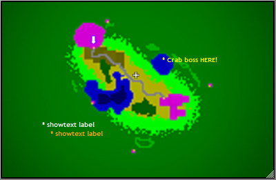
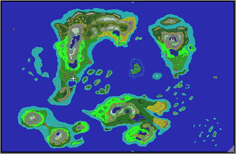

# IMap_GMCP

*Author: Ruthgul* 

### A visual mini-map for the wilds
---
#### Features:
* A visual map of the wilds including the overworld, ethereal plane, and the underground. A customizable image marks your current location.
* Additional support for a destination icon and text labels.
* Automatic swapping of the map to highlight ship-to-ship PVP areas while sailing.

#### Dependencies:
* MM_GMCP_Handler.xml [f67c4339ed0591a5b010d05b]
* Client output must convert IAC EOR/GA to newline

#### Aliases
* **imap dest** \<x, y>
* **imap dest** \<on | off>
  > Draw a reference guide for a target world coordinate form of an absolute position of `x, y`. The guide will take the form of an arrow on the mini-map which can be explicitly shown or hidden with the parameters `on` or `off`.

* **imap gamma** [on | off]
  > Toggle gamma correction `on` or `off` for the visual map. This feature is off by default.

* **imap hide**
  > Sets the map mini-map window to hidden.

* **imap icon** \<arrow | circ | cross | ship | horse>
  > Set the image to be used for representing your character's location on the mini-map. The default is `arrow`.

* **imap label** \<x, y, color, text>
* **imap label** \<off>
  > Sets a persistent label on the mini-map (limit 1) with the given text. The label can be explicitly hidden with the parameter `off`.

* **imap recolor spk** [on | off]
  > Toggles the mini-map to display color for Alyria's ship-to-ship PK waters in the overworld and the Underground. This feature is `on` by default.

* **imap reset**
  > Restore the default mini-map size

* **imap shipicon** \<arrow | circ | cross | ship | horse>
  > Set the image to be used for representing your character's location on the mini-map while aboard a ship. The default is `cross`.

* **imap show**
  > Sets the map mini-map window to visible.

* ~~**imap showlocation** \<location> [text]~~
  > ~~Show a marker on the mini-map indicating the target location (limit 1). This alias requires a full location name. The marker is non-persistent and will vanish once your player moves. The default text for the marker is `x`.~~
  > https://github.com/vertically-impaired/mm_plugin_documentation/issues/4 
  > https://github.com/vertically-impaired/mm_plugin_documentation/issues/5 
  > https://github.com/vertically-impaired/mm_plugin_documentation/issues/6

* **imap showtext** \<x, y, color, text>
  > Sets a label on the mini-map (unlimited) with the given text. This label is non-persistent and will vanish once your player moves.

* **imap spk color** \<purple | red>
  > Sets the color for ship-t-ship PK waters in the overworld and the Underground. The default is `purple`.

#### Screenshots:

[//]: # // Mini-map screenshot //

[//]: # Player position: 54, 42

[//]: # imap icon cross

[//]: # imap dest 30,25

[//]: # imap label 69, 33, yellow,* Crab boss HERE!

[//]: # imap showtext 15, 70, white, * showtext label

[//]: # imap showtext 20, 75, orange, * showtext label
