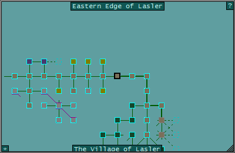
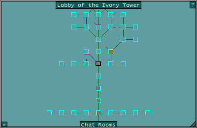
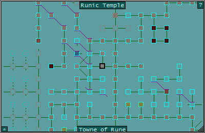

# MM_GMCP_Mapper_GMCP

*Author: Ruthgul* 
*Original plugin by [Nick Gammon](http://www.gammon.com.au/forum/?id=10667)*

### A visual mini-map for towns and dungeons
---
#### Features:
* A visual map of towns, cities, and dungeons with a complete database of all Alyria and its planes.
* GMCP-driven auto-mapper and database.

#### Dependencies:

- mm_mapper.lua
- MM_GMCP_Handler.xml [f67c4339ed0591a5b010d05b]

- Client output must convert IAC EOR/GA to newline
- Set SHOW-EXISTS must be set to ON in the game (enabled by default)

#### Aliases:

* **mapper adjacent** \<room_name>
  > Display a list of rooms adjacent to the target room by name.

* **mapper auto-open** [on | off]
  > Toggle or explicitly set mapper's speedwalk to automatically open doors. This feature is on by default.

* **mapper bookmarks**
  > Display a list of nearby rooms that have been bookmarked, up to the maximum distance as configured. The maximum distance is 250 rooms by default.

* **mapper color terrain** [on | off]
  > Toggle or explicitly set the mini-map to disregard the the colors of special rooms such as safe rooms, shops, trainers, and PVP areas. This feature is disabled by default.

* **mapper cpks**
  > Display a list of nearby rooms flagged as CPK, up to the maximum distance as configured. The maximum distance is 250 rooms by default.

* **mapper draw other floors** [on | off]
  > Toggle or explicitly set the drawing of overlays depicting floors above and below on the mini-map. This feature is on by default.

* **mapper dts**
  > Display a list of nearby rooms flagged as death traps.

* **mapper find** \<text>
  > Search the mapper database of rooms for those whose names contain the matching text.

* **mapper findbm** \<text>
  > Search the mapper database of bookmarks whose names which contain the matching text.

* **mapper flags** \<flags>
  > Search the mapper database of rooms for those which contain the matching flags. Multiple flags must be delimited by a space.

* **mapper goto** \<id>
  > Speedwalk to the target room by its unique identifier.

* **mapper hide**
  > Hide the mini-map if it is currently visible.

* **mapper map wilds** [on | off]
  > Toggle or explicitly set the automatic mapping the wilds. Enabling this feature will add new rooms to the database as you explore the wilds. This should not be used outside of adding new roads to the database as they will be considered when building routes for speedwalking. This feature is off by default.

* **mapper notflags** \<flags>
  > Search the mapper database of rooms for those which do not contain the matching flags. Multiple flags must be delimited by a space.

* **mapper path** \<id1> [id2]
  > Display a line of text showing directions to the target room, from either the current room, or from one room to another, by its unique identifier.

* **mapper peek** [id]
  > Temporarily redraw the mini-map centered the target room by its unique identifier. Using the `look` command or moving to another room will reset the mini-map to center on your current location.

* **mapper purge area** \<area>
  > Delete an entire area from the database. Use with caution.

* **mapper purge molehill**
  > Delete all rooms from the molehill maze from the database.

* **mapper purge pursuer**
  > Delete all rooms from the orc pursuer maze from the database

* **mapper purge sandbox**
  > Delete all housing sandbox rooms from the database.

* **mapper purge wilds** \<plane>
  > Delete all rooms which are considered to be wilds from the target plane from the database. This will not purge rooms which are roads.

* **mapper resume**
  > Resume the last interrupted mapper speedwalk.

* **mapper safes**
  > Display a list of nearby rooms flagged as safe, up to the maximum distance as configured. The maximum distance is 250 rooms by default.

* **mapper safewalk** [on | off]
  > Toggle or explicitly set mapper to avoid room flagged for PK and deathraps. This will only affect speedwalks performed by the `mapper goto` alias.

* **mapper shops**
  > Display a list of nearby rooms which have been flagged as shops, up to the maximum distance as configured. The maximum distance is 250 rooms by default.

* **mapper show flags** [on | off]
  > Toggle or explicitly set mapper to display a line above the room description identifying what flags it has set. This feature is set to off by default.

* **mapper show numbers** [on | off]
  > Toggle or explicitly set mapper to display a line above the room description identifying its unique identifier. This feature is set to off by default. Note that the room id is only visible when `set visually-impaired` is set to `on`.

* **mapper show road exits** [on | off]
  > Toggle or explicitly set mapper to display a line after `Visible Exits` for the current room identifying which adjacent rooms are along the road, if you are standing on one. This feature is set to off by default. Note that the room id is only visible when `set visually-impaired` is set to `on`.

* **mapper show unmapped exits** [on | off]
  > Toggle or explicitly set mapper to display a line after `Visible Exits` for the current room identifying which adjacent rooms are accessible but unmapped. This feature is set to off by default. Note that the room id is only visible when `set visually-impaired` is set to `on`.

* **mapper show**
  > Display the mini-map if it is currently hidden.

* **mapper speedwalk next**
  > Display a line (or SAPI say for VI) the next direction of the current mapper speedwalk. This is useful if you don't know which direction to flee while preserving your existing path.

* **mapper stop**
  > Cancel the current mapper speedwalk.

* **mapper trainers**
  > Display a list of nearby rooms flagged as having a trainer, up to the maximum distance as configured. The maximum distance is 250 rooms by default.

* **mapper where** \<text>
  > Search the database and display a list of unique identifiers for all room names which contain the matching text. Note that `%` may be used as a wildcard character.

* **mapper zoom in**
  > Zoom the mini-map in.

* **mapper zoom out**
  > Zoom the mini-map out.

#### Advanced Aliases:
* **mapper addbm** [id] \[b:\<name>]
  > Add a bookmark to the mapper database for the current room or for a target room by its unique identifier. If no name is specified then the default of 'x' will be used.

* **mapper addexit** \<direction> [f:\<id_from>] t:\<id_to>
  > Add an exit to the mapper database for the current room or for a target room by its unique identifier.
  > <table>
  >    <tr>
  >       <td colspan="12">Directions:</td>
  >    </tr>
  >    <tr>
  >       <td>n</td>
  >       <td>e</td>
  >       <td>s</td>
  >       <td>e</td>
  >       <td>ne</td>
  >       <td>se</td>
  >       <td>nw</td>
  >       <td>sw</td>
  >       <td>u</td>
  >       <td>d</td>
  >       <td>tprt</td>
  >       <td>prtl</td>
  >    </tr>
  > </table>

* **mapper addroom** \<id> n:\<name> a:\<area> f:\<flags> t:\<terrain> ti:\<terraininfo>
  > Add a room to the mapper database by its unique identifier, name, area, flags, and other information.
  > <table>
  >    <tr>
  >       <td colspan="5">Flags:</td>
  >    </tr>
  >       <td>anti-magic</td>
  >       <td>dark</td>
  >       <td>disorient</td>
  >       <td>double-pk-damage</td>
  >       <td>energy-draining</td>
  >    </tr>
  >    <tr>
  >       <td>fear</td>
  >       <td>grapple-required</td>
  >       <td>half-pk-damage</td>
  >       <td>high-regen</td>
  >       <td>icy-conditions</td>
  >    </tr>
  >    <tr>
  >       <td>indoors</td>
  >       <td>low-regen</td>
  >       <td>magic-unstable</td>
  >       <td>momentary-darkness</td>
  >       <td>no-area-affects</td>
  >    </tr>
  >    <tr>
  >       <td>no-chat</td>
  >       <td>no-disguise</td>
  >       <td>no-emote</td>
  >       <td>no-fear</td>
  >       <td>no-form</td>
  >    </tr>
  >    <tr>
  >       <td>no-mount</td>
  >       <td>no-npcs</td>
  >       <td>no-outside-noise</td>
  >       <td>no-recall</td>
  >       <td>no-regen</td>
  >    </tr>
  >    <tr>
  >       <td>no-teleview</td>
  >       <td>no-track</td>
  >       <td>no-trap</td>
  >       <td>no-unforming-allowed</td>
  >       <td>player-kill-chaotic</td>
  >    </tr>
  >    <tr>
  >       <td>player-kill-lawful</td>
  >       <td>player-kill-neutral</td>
  >       <td>private</td>
  >       <td>psychotic-combat</td>
  >       <td>reinforced</td>
  >    </tr>
  >    <tr>
  >       <td>safe</td>
  >       <td>silence</td>
  >       <td>solitary</td>
  >       <td>tangle-vine</td>
  >       <td>thunderstorm</td>
  >    </tr>
  >    <tr>
  >       <td>Unknown</td>
  >       <td>vanishing-items</td>
  >       <td>windy</td>
  >    </tr>
  > </table>
  > 
  > <table>
  >    <tr>
  >       <td colspan="5">Terrain:</td>
  >    </tr>
  >    <tr>
  >       <td>acid-pool</td>
  >       <td>air</td>
  >       <td>beach</td>
  >       <td>bridge</td>
  >       <td>chasm</td>
  >    </tr>
  >    <tr>
  >       <td>city street</td>
  >       <td>cliff</td>
  >       <td>craggy mountain</td>
  >       <td>deep water</td>
  >       <td>dense forest</td>
  >    </tr>
  >    <tr>
  >       <td>desert</td>
  >       <td>dungeon</td>
  >       <td>dusty road</td>
  >       <td>foothills</td>
  >       <td>fresh-water-swimmable</td>
  >    </tr>
  >    <tr>
  >       <td>glacier</td>
  >       <td>grassy field</td>
  >       <td>gravel road</td>
  >       <td>hay-ground</td>
  >       <td>hills</td>
  >    </tr>
  >    <tr>
  >       <td>ice</td>
  >       <td>indoors</td>
  >       <td>jungle</td>
  >       <td>lava</td>
  >       <td>light forest</td>
  >    </tr>
  >    <tr>
  >       <td>mossy ground</td>
  >       <td>mountainous</td>
  >       <td>paved road</td>
  >       <td>plain</td>
  >       <td>rocky ground</td>
  >    </tr>
  >    <tr>
  >       <td>salt water</td>
  >       <td>savannah</td>
  >       <td>shallow water</td>
  >       <td>sheer mountain</td>
  >       <td>slippery floor</td>
  >    </tr>
  >    <tr>
  >       <td>snow</td>
  >       <td>stream</td>
  >       <td>swamp</td>
  >       <td>trail</td>
  >       <td>underwater-ground</td>
  >    </tr>
  >    <tr>
  >       <td>underwater</td>
  >       <td>Unknown</td>
  >       <td>void</td>
  >    </tr>
  > </table>
  > 
  > <table>
  >    <tr>
  >       <td colspan="6">Terrain Info:</td>
  >    </tr>
  >    <tr>
  >       <td>acid</td>
  >       <td>climbable</td>
  >       <td>copper-mineable</td>
  >       <td>diggable</td>
  >       <td>drinkable-water</td>
  >       <td>fire</td>
  >    </tr>
  >    <tr>
  >       <td>fishable</td>
  >       <td>freezing</td>
  >       <td>hard</td>
  >       <td>iron-mineable</td>
  >       <td>nothing</td>
  >       <td>plains</td>
  >    </tr>
  >    <tr>
  >       <td>poison-gas</td>
  >       <td>sailable</td>
  >       <td>salt-mineable</td>
  >       <td>shallow</td>
  >       <td>sheltered</td>
  >       <td>silver-mineable</td>
  >    </tr>
  >    <tr>
  >       <td>slippery</td>
  >       <td>swimmable</td>
  >       <td>underwater</td>
  >       <td>Unknown</td>
  >       <td>wooded</td>
  >    </tr>
  > </table>

* **mapper delbm** [id]
  > Delete a bookmark from the mapper database.

* **mapper delexit** \<direction> [f:\<id>]
  > Delete an exit from the mapper database for the current room or for a target room by its unique identifier.
  > <table>
  >    <tr>
  >       <td colspan="12">Directions:</td>
  >    </tr>
  >    <tr>
  >       <td>n</td>
  >       <td>e</td>
  >       <td>s</td>
  >       <td>e</td>
  >       <td>ne</td>
  >       <td>se</td>
  >       <td>nw</td>
  >       <td>sw</td>
  >       <td>u</td>
  >       <td>d</td>
  >       <td>tprt</td>
  >       <td>prtl</td>
  >    </tr>
  > </table>

* **mapper delexits** \<id>
  > delete all exits from a room

* **mapper delroom** \<id>
  > delete a room

* **mapper dt** [id]
  > tag room as DT

* **mapper export area** \<name>
  > exports a whole area

* **mapper export rooms** \<name>
  > exports all rooms matching the name

* **mapper no-speed** [id]
  > tag room as no-speed

* **mapper purge bookmarks**
  > purge all non-vmap notes from the database

* **mapper purge clanhalls**
  > purge clanhalls data from the database

* **mapper purge homes**
  > purge player homes data from the database

* **mapper rebuild lookup**
  > rebuild the rooms_lookup table

* **mapper recreate database**
  > copy data to a new database file

* **mapper reset defaults**
  > use to restore default settings, if necessary

* **mapper roominfo** [id]
  >  show info about a room

* **mapper shop** [id]
  > tag room as shop

* **mapper show database mods** [on | off]
  > toggle showing database updates on/off (on by default)

* **mapper trainer** [id]
  > tag room as trainer

* **mapper trap** [id]
  > tag room as trap

#### Screenshots:

   

