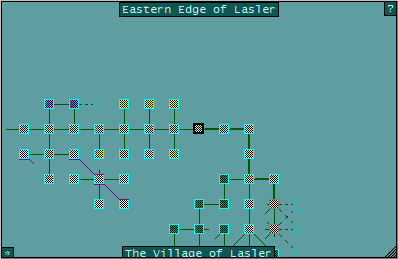

# switch_maps

*Author: Ruthgul* 

### Automatic mini-map switcher based on location
---
#### Features:
* Automatically show or hide the world mini-map and the town mini-map depending on our location.

#### Dependencies:
* IMap_GMCP.xml [adc3a873d4e47348da7cb426]
* MM_GMCP_Handler.xml [f67c4339ed0591a5b010d05b]
* MM_GMCP_Mapper_GMCP.xml [f973af093e715dece34dc25f]

#### Screenshots:
