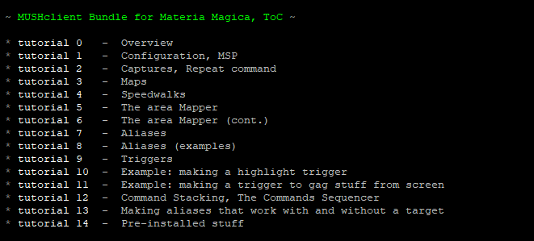
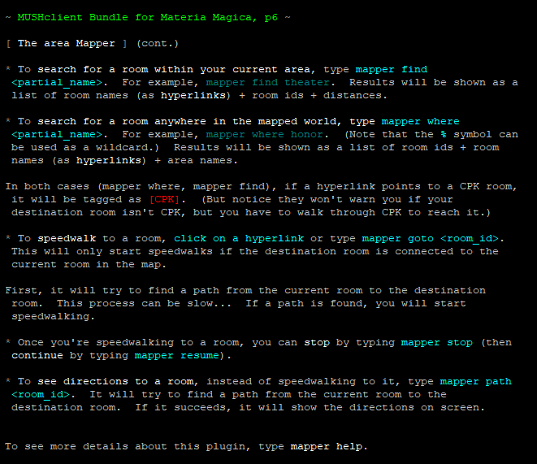
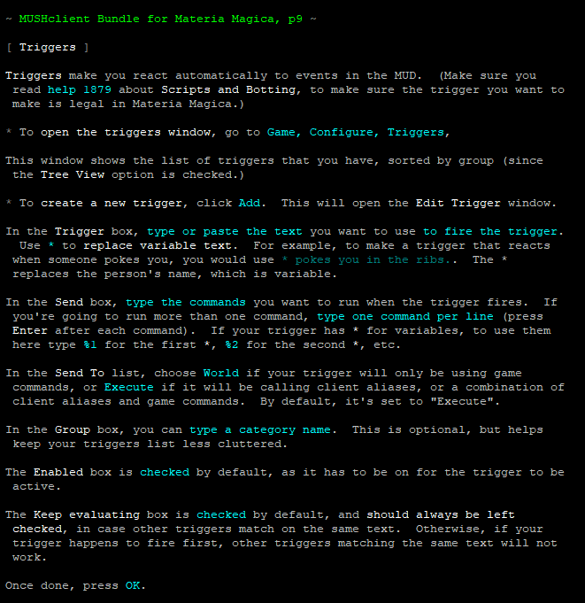

# tutorial

*Author: Ruthgul* 

### An introduction to using the MUSHclient bundle
---
#### Features:
* A series of one-page tutorials to show the basic operation of the MUSHclient bundle for Materia Magica.

#### Aliases:
* **tutorial** [page]

#### Screenshots:

