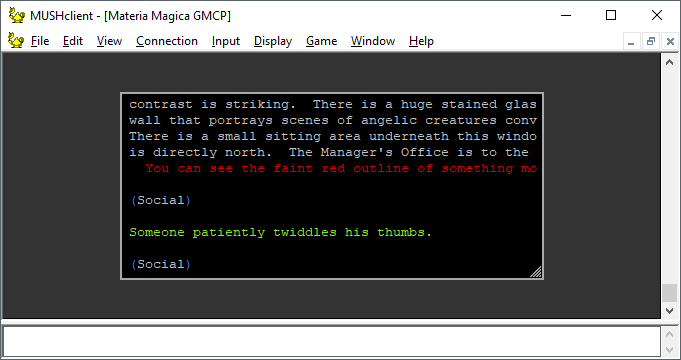

# world_mini

*Author: Fiendish, Lasher, Ruthgul* 

### Render the connected world as a mini-window
---
#### Features:
* Allows the output for the connected work to render as a mini-window for customizable repositioning along with other mini-window interface elements.

#### Dependencies:
* world_miniwindow.lua

#### Aliases:
* ~~reset main~~
  > https://github.com/vertically-impaired/mm_plugin_documentation/issues/7

#### Screenshots:

